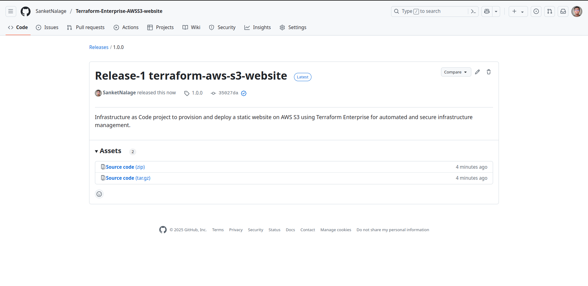
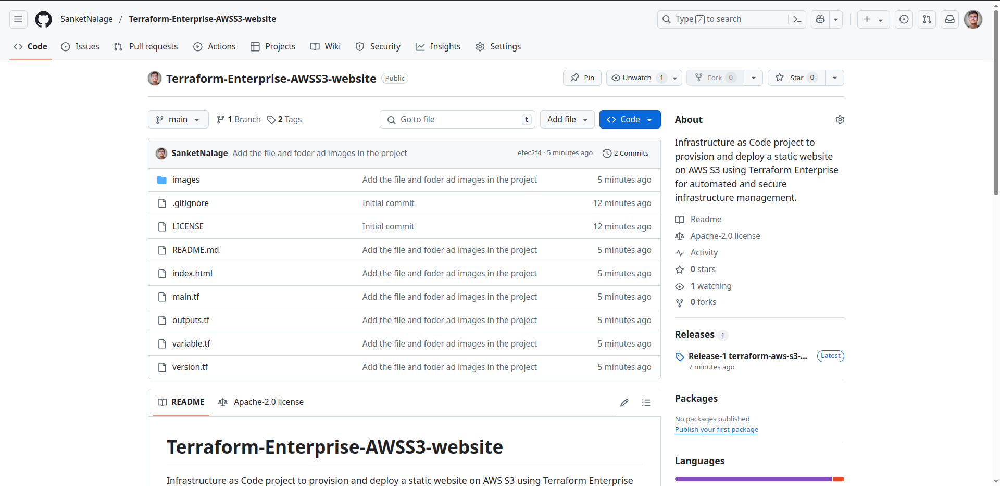

# Terraform-Enterprise-AWSS3-website
Infrastructure as Code project to provision and deploy a static website on AWS S3 using Terraform Enterprise for automated and secure infrastructure management.

## Step-01: Craete new Github Repository
- **URL:** github.com
- Click on **Create a new repository**
- Follow Naming Conventions for modules
  - terraform-PROVIDER-MODULE_NAME
  - **Sample:** Terraform-Enterprise-AWSS3-website
- **Repository Name:** terraform-aws-s3-website
- **Description:** Terraform Modules to be shared in Private Registry
- **Repo Type:** Public / Private
- **Initialize this repository with:**
- **UN-CHECK** - Add a README file
- **CHECK** - Add .gitignore 
- **Select .gitignore Template:** Terraform
- **CHECK** - Choose a license
- **Select License:** Apache 2.0 License  (Optional)
- Click on **Create repository**

## Step-02: Create New Release Tag 1.0.0 in Repo
- Go to Right Navigation on github Repo -> Releases -> Create a new release
- **Tag Version:** v1.0.0
- **Release Title:** Release-1 terraform-aws-s3-website
- **Write:** Terraform Module for Private Registry - terraform-aws-s3-website
- Click on **Publish Release**
 

   
 

   

