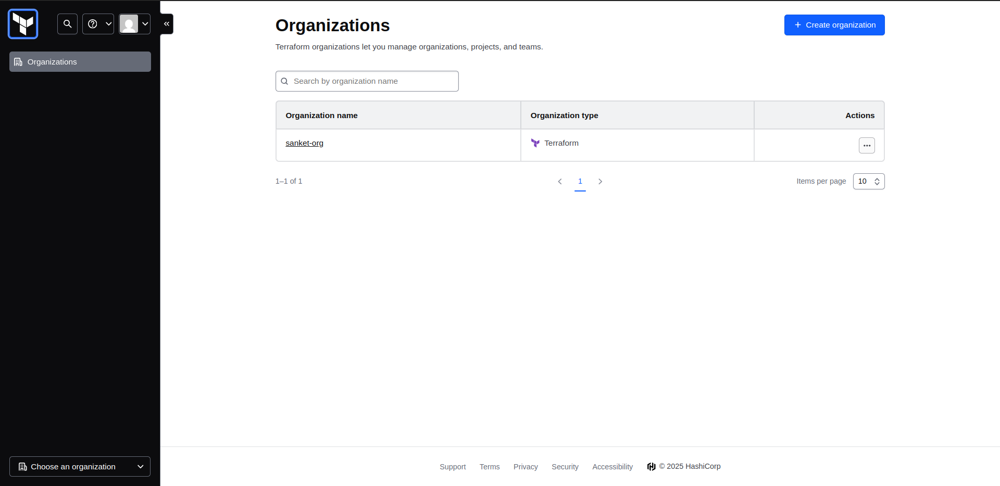
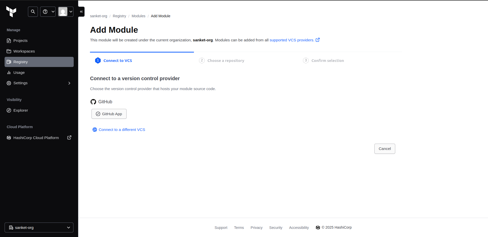
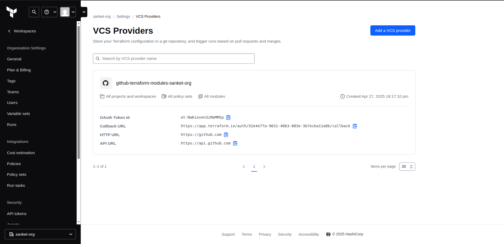
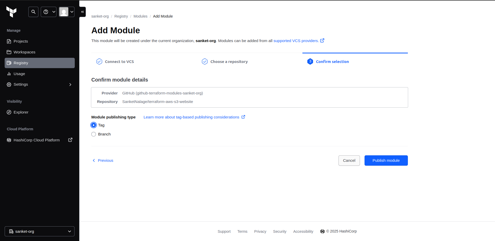
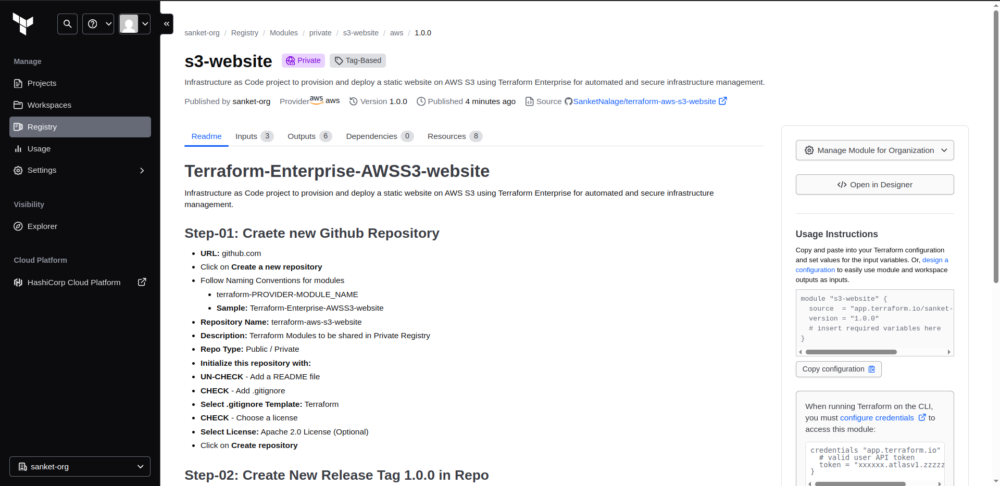

# Terraform-Enterprise-AWSS3-website
Infrastructure as Code project to provision and deploy a static website on AWS S3 using Terraform Enterprise for automated and secure infrastructure management.

## Step-01: Craete new Github Repository
- **URL:** github.com
- Click on **Create a new repository**
- Follow Naming Conventions for modules
  - terraform-PROVIDER-MODULE_NAME
  - **Sample:** Terraform-Enterprise-AWSS3-website
- **Repository Name:** terraform-aws-s3-website
- **Description:** Terraform Modules to be shared in Private Registry
- **Repo Type:** Public / Private
- **Initialize this repository with:**
- **UN-CHECK** - Add a README file
- **CHECK** - Add .gitignore 
- **Select .gitignore Template:** Terraform
- **CHECK** - Choose a license
- **Select License:** Apache 2.0 License  (Optional)
- Click on **Create repository**

## Step-02: Create New Release Tag 1.0.0 in Repo
- Go to Right Navigation on github Repo -> Releases -> Create a new release
- **Tag Version:** v1.0.0
- **Release Title:** Release-1 terraform-aws-s3-website
- **Write:** Terraform Module for Private Registry - terraform-aws-s3-website
- Click on **Publish Release**
 

   
 

   

## Step-03: Add VCS Provider as Github using OAuth App in Terraform Cloud
- Login to Terraform Cloud
- Click on Modules Tab -> Click on Add Module -> Select Github(custom)
- Should redirect to URL: https://github.com/settings/applications/new in new browser tab
- **Application Name:** HCP Terraform (sanket-org) 
- **Homepage URL:**	https://app.terraform.io 
- **Application description:**	Terraform Cloud Integration with Github using OAuth 
- **Authorization callback URL:**	https://app.terraform.io/auth/f53695b8-9733-40f0-9853-89cb5396610b/callback 
- Click on **Register Application**
- Make a note of Client ID: 97e5219d6edd8986817e (Sample for reference)
- Generate new Client Secret: abcdefghijklmnopqrstuvwxyx

 

  
 

  

## Step-04: Add the below in Terraform Cloud
- Name: github-terraform-modules
- Client ID: 97e5219d6edd8986817e
- Client Secret: abcdefghijklmnopqrstuvwxyx
- Click on **Connect and Continue**
- Authorize Terraform Cloud (hctaprep) - Click on **Authorize StackSimplify**
- SSH Keypair (Optional): click on **Skip and Finish**
 

  

## Step-05: Import the Terraform Module from Github
- In above step, we have completed the VCS Setup with github
- Now lets go ahead and import the Terraform module from Github
- Login to Terraform Cloud
- Click on Modules Tab -> Click on Add Module -> Select Github(github-terraform-modules) (PRE-POPULATED) -> Select it
- **Choose a Repository:** terraform-module-s3-website
- Click on **Publish Module**
 

  
 

  

